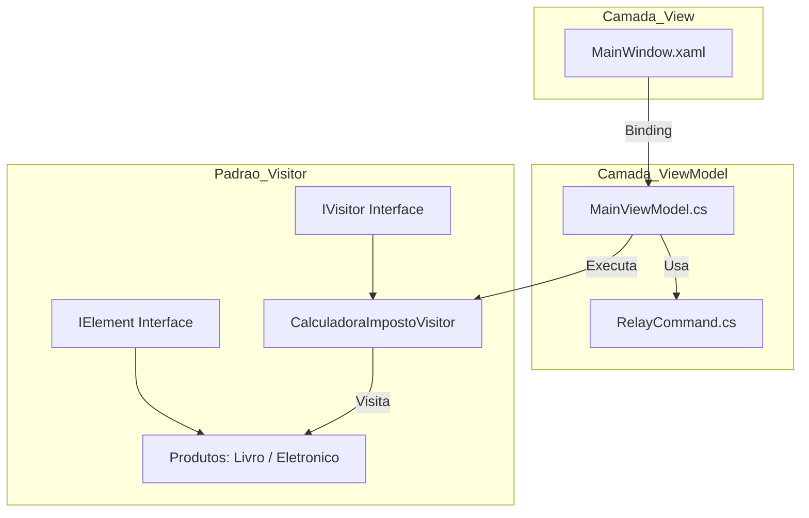

# Projeto Design Pattern Visitor
Este projeto foi desenvolvido como parte da atividade de Situação de Aprendizagem para a disciplina de Desenvolvimento de Sistemas. O objetivo principal é demonstrar a implementação prática do padrão de projeto Visitor, utilizando a arquitetura MVVM em uma aplicação WPF (C#).

---
## 🛠️ Tecnologias Utilizadas

- Linguagem: C#;

- Framework UI: WPF (.NET);

- Arquitetura: MVVM (Model-View-ViewModel);

- Padrão de Projeto: Visitor.


## 📊 Arquitetura do Projeto (Visitor + MVVM)


---

## 📁 Estrutura do Projeto

Quando selecionado dentro do projeto a 'BRANCH' master da para ver claramente as organização do código, como tive problema em subir pelo git com o main consegui somente com o MASTER foi organizado conforme as melhores práticas de desenvolvimento e como aprendido em sala o modelo MVVM (sendo uma arquitetura de software que separa a interface do usuário (View) da lógica de negócios (Model) através de uma camada intermediária (ViewModel), facilitando a manutenção e os testes unitários.) Sabendo disso a organização do meu trabalho começou pela pasta Command possuindo a classe RelayCommad que foi esponsável por encapsular a lógica de execução dos botões da interface. Segue abaixo o código utilizado:

```

using System.Windows.Input;
  
namespace AppVisitor.Commands;
  
public class RelayCommand: ICommand{
  
    private readonly Action execute;
    private readonly Func<bool> canExecute;
  
    public RelayCommand(Action execute, Func<bool> canExecute = null)
    {
        this.execute = execute;
        this.canExecute = canExecute;
    }
  
    public bool CanExecute(object parameter)
    {
        return canExecute == null || canExecute();
    }
  
    public void Execute(object parameter)
    {
        execute();
    }
          
    public event EventHandler CanExecuteChanged
    {
        add { CommandManager.RequerySuggested += value; }
        remove { CommandManager.RequerySuggested -= value; }
    }
          
};
```

