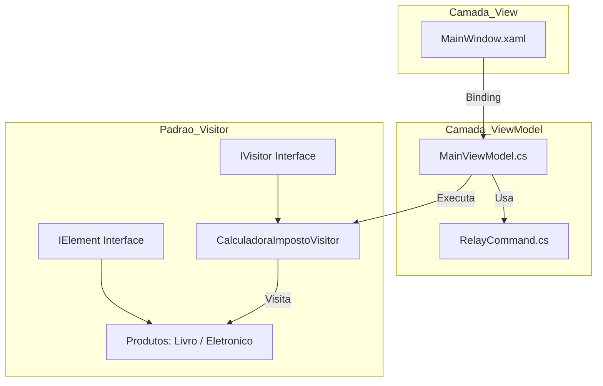

# Projeto Design Pattern Visitor
Este projeto foi desenvolvido como parte da atividade de Situação de Aprendizagem para a disciplina de Desenvolvimento de Sistemas. O objetivo principal é demonstrar a implementação prática do padrão de projeto Visitor, utilizando a arquitetura MVVM em uma aplicação WPF (C#).Onde devem representar soluções consolidadas para problemas recorrentes na engenharia de software, sendo amplamente aplicados em sistemas modernos.

---

##  O que é o Design Pattern - Visitor:

É um método de programação orientada a objetos (POO) chamado padrão de projeto Visitor que permite adicionar novas operações a classes preexistentes sem alterá-las. O padrão de projeto Visitor é um padrão comportamental que permite a adição de novas operações a classes existentes sem modificar sua estrutura. Ele separa os algoritmos dos objetos sobre os quais operam, melhorando a modularidade e a manutenibilidade.

---
##  Vantagens e desvantagens do Design Pattern - Visitor:

| Vantagens | Desvantagens |
| :--- | :--- |
| **Separação de Responsabilidades:** Mantém as operações separadas dos objetos, facilitando o gerenciamento e a compreensão. | **Complexidade Adicional:** Pode tornar o código mais complicado com o aumento de tipos de objetos ou operações. |
| **Facilidade para Novos Recursos:** Introduz novas operações criando visitantes sem a necessidade de alterar as classes dos objetos. | **Dificuldade em Novos Objetos:** Introduzir novos tipos de objetos exige alterações em todas as classes de visitantes existentes. |
| **Lógica Centralizada:** Operações concentradas em um só lugar ajudam a visualizar interações e simplificam a manutenção. | **Acoplamento Rígido:** Os visitantes precisam conhecer todos os tipos de objetos específicos, criando dependências fortes. |
| **Segurança de Tipo:** Cada método de visitante é específico para um tipo de objeto, ajudando a detectar erros precocemente. | **Mais Classes para Gerenciar:** O padrão pode levar a um excesso de interfaces e classes extras na base de código. |
| **Manutenção Simplificada:** Permite atualizar ou corrigir lógicas na classe Visitor sem mexer na estrutura estável dos objetos. | **Inadequado para Mudanças Frequentes:** Se os tipos de objetos mudam muito, o padrão gera um alto custo de atualização. |

---

##  Objetivo do meu projeto:


##  Tecnologias Utilizadas

- Linguagem: C#;

- Framework UI: WPF (.NET);

- Arquitetura: MVVM (Model-View-ViewModel);

- Padrão de Projeto: Visitor.


##  Arquitetura do Projeto (Visitor + MVVM)


---

##  Estrutura do Projeto - Command/RelayCommand

Quando selecionado dentro do projeto a 'BRANCH' master da para ver claramente as organização do código, como tive problema em subir pelo git com o main consegui somente com o MASTER foi organizado conforme as melhores práticas de desenvolvimento e como aprendido em sala o modelo MVVM (sendo uma arquitetura de software que separa a interface do usuário (View) da lógica de negócios (Model) através de uma camada intermediária (ViewModel), facilitando a manutenção e os testes unitários.) Sabendo disso a organização do meu trabalho começou pela pasta Command possuindo a classe RelayCommad que foi esponsável por encapsular a lógica de execução dos botões da interface. Segue abaixo o código utilizado:

```

using System.Windows.Input;
  
namespace AppVisitor.Commands;
  
public class RelayCommand: ICommand{
  
    private readonly Action execute;
    private readonly Func<bool> canExecute;
  
    public RelayCommand(Action execute, Func<bool> canExecute = null)
    {
        this.execute = execute;
        this.canExecute = canExecute;
    }
  
    public bool CanExecute(object parameter)
    {
        return canExecute == null || canExecute();
    }
  
    public void Execute(object parameter)
    {
        execute();
    }
          
    public event EventHandler CanExecuteChanged
    {
        add { CommandManager.RequerySuggested += value; }
        remove { CommandManager.RequerySuggested -= value; }
    }
          
};
```
---
## Estrutura do Projeto - Data/BaseViewModel, DataBase, RelatorioVisitor, TarefaRepository e UsuarioRepository
A pasta Data é a parte mais importante do projeto, sendo responsável por isolar toda a complexidade de infraestrutura e persistência da lógica de interface. Nesta camada, o SQLite é gerenciado para garantir que os dados sejam salvos permanentemente, enquanto os Repositories abstraem as consultas SQL, permitindo que a ViewModel solicite dados sem saber "como" eles são buscados.

Além disso, é aqui que reside a inteligência do padrão Visitor aplicada à geração de informações: o RelatorioVisitor.cs utiliza os dados brutos vindos do banco para transformá-los em um produto final formatado, provando que podemos estender as funcionalidades do sistema sem poluir nossos modelos originais. E consigo pegar a linguagem escolhida que é o Visitor.

BaseViewModel:

```
using System.ComponentModel;

namespace AppVisitor.Models;
public class BaseViewModel : INotifyPropertyChanged
{
    public event PropertyChangedEventHandler PropertyChanged;

    protected void OnPropertyChanged(string prop)
    {
        PropertyChanged?.Invoke(this, new PropertyChangedEventArgs(prop));
    }
}
```
---

DataBase:

```
using System;
using System.IO;
using Microsoft.Data.Sqlite; 

namespace AppVisitor.Data;

public static class DataBase
{
    private static readonly string pastaBase = Path.Combine(
        Environment.GetFolderPath(Environment.SpecialFolder.MyDocuments), "AppVisitor");

    private static readonly string caminhoBanco = Path.Combine(pastaBase, "tarefas.db");
    private static readonly string connectionString = $"Data Source={caminhoBanco}";

    static DataBase()
    {
        
        if (!Directory.Exists(pastaBase))
            Directory.CreateDirectory(pastaBase);

        
        using (var conn = GetConnection())
        {
            conn.Open();
            var cmd = conn.CreateCommand();
            cmd.CommandText = @"
                CREATE TABLE IF NOT EXISTS Usuario (
                    id_usuario INTEGER PRIMARY KEY AUTOINCREMENT, 
                    nome TEXT
                );
                CREATE TABLE IF NOT EXISTS Tarefa (
                    id_tarefa INTEGER PRIMARY KEY AUTOINCREMENT, 
                    titulo TEXT, 
                    conteudo TEXT, 
                    concluida INTEGER, 
                    data_limite TEXT, 
                    fk_usuario_id INTEGER,
                    FOREIGN KEY(fk_usuario_id) REFERENCES Usuario(id_usuario)
                );";
            cmd.ExecuteNonQuery();
        }
    }
    
    public static SqliteConnection GetConnection() 
    {
        return new SqliteConnection(connectionString);
    }
}
```

RelatorioVisitor:

```
using System.Text;
using AppVisitor.Models;

namespace AppVisitor.Data;

public class RelatorioVisitor : IVisitor
{
    private StringBuilder _sb = new StringBuilder();

    public string Resultado => _sb.ToString();

    // Lógica do Visor
    public void VisitUsuario(Usuario usuario)
    {
        _sb.AppendLine("**************************************");
        _sb.AppendLine($"RELATÓRIO ORGANIZADO DE: {usuario.Nome.ToUpper()}");
        _sb.AppendLine("**************************************\n");
    }
    
    public void VisitTarefa(Tarefa tarefa)
    {
        string status = tarefa.Concluida ? "[CONCLUÍDA]" : "[ PENDENTE ]";
        _sb.AppendLine($"{status} - {tarefa.Titulo}");
        if (!string.IsNullOrEmpty(tarefa.Conteudo))
            _sb.AppendLine($"   Nota: {tarefa.Conteudo}");
    }
}
```
---
TarefaRepository:
```
using System;
using System.Collections.Generic;
using AppVisitor.Models;
using Microsoft.Data.Sqlite;

namespace AppVisitor.Data;

public class TarefaRepository
{
    public void Inserir(Tarefa tarefa)
    {
        using var conn = DataBase.GetConnection();
        conn.Open();
        var cmd = new SqliteCommand(
            "INSERT INTO Tarefa (titulo, conteudo, concluida, data_limite, fk_usuario_id) VALUES (@t, @c, @con, @d, @u)", 
            conn);

        cmd.Parameters.AddWithValue("@t", tarefa.Titulo);
        cmd.Parameters.AddWithValue("@c", tarefa.Conteudo ?? "");
        cmd.Parameters.AddWithValue("@con", tarefa.Concluida ? 1 : 0);
        cmd.Parameters.AddWithValue("@d", tarefa.Data_Limite?.ToString("yyyy-MM-dd") ?? (object)DBNull.Value);
        cmd.Parameters.AddWithValue("@u", tarefa.Fk_Usuario_Id ?? (object)DBNull.Value);

        cmd.ExecuteNonQuery();
    }

    public List<Tarefa> Listar()
    {
        var lista = new List<Tarefa>();
        using var conn = DataBase.GetConnection();
        conn.Open();
        var cmd = new SqliteCommand("SELECT * FROM Tarefa", conn);
        using var reader = cmd.ExecuteReader();
        while (reader.Read())
        {
            lista.Add(new Tarefa {
                Id_Tarefa = reader.GetInt32(0),
                Titulo = reader.GetString(1),
                Conteudo = reader.IsDBNull(2) ? "" : reader.GetString(2),
                Concluida = reader.GetInt32(3) == 1,
                Data_Limite = reader.IsDBNull(4) ? null : DateTime.Parse(reader.GetString(4))
            });
        }
        return lista;
    }
}
```
---
UsuarioRepository:
```
using System;
using Microsoft.Data.Sqlite;

namespace AppVisitor.Data;

public class UsuarioRepository
{
    public int InserirOuRetornarId(string nome)
    {
        using var conn = DataBase.GetConnection();
        conn.Open();
        
        var cmd = new SqliteCommand("SELECT id_usuario FROM Usuario WHERE nome = @nome", conn);
        cmd.Parameters.AddWithValue("@nome", nome);
        
        var result = cmd.ExecuteScalar();
        if (result != null)
            return Convert.ToInt32(result);
        
        cmd = new SqliteCommand("INSERT INTO Usuario(nome) VALUES (@nome); SELECT last_insert_rowid();", conn);
        cmd.Parameters.AddWithValue("@nome", nome);
        
        return Convert.ToInt32(cmd.ExecuteScalar());
    }
}
```
---

##  Estrutura do Projeto - Models/IVistor, Tarefa e Usuario

A pasta Model implementa a interface IElement, o que significa que cada objeto de modelo "abre suas portas" para ser visitado por um consultor externo (o Visitor). Essa abordagem é o que permite que o sistema seja extensível: se amanhã precisarmos de um exportador para Excel ou um calculador de prazos, não precisaremos alterar uma única linha de código dentro das classes Tarefa ou Usuario; basta criar um novo Visitor que saiba como interagir com elas através do método Accept.

---
IVisitor:
```
namespace AppVisitor.Models;

public interface IVisitor {
    void VisitTarefa(Tarefa tarefa);
    void VisitUsuario(Usuario usuario);
}

public interface IElement {
    void Accept(IVisitor visitor);
}
```

---
Tarefa:
```
namespace AppVisitor.Models;
public class Tarefa : IElement {
    public int Id_Tarefa { get; set; }
    public string Titulo { get; set; }
    public string Conteudo { get; set; }
    public bool Concluida { get; set; }
    public DateTime? Data_Limite { get; set; }
    public int? Fk_Usuario_Id { get; set; }
    public void Accept(IVisitor visitor) => visitor.VisitTarefa(this);
}
```

---
Usuario:
```
namespace AppVisitor.Models;
public class Usuario : IElement {
    public int Id_Usuario { get; set; }
    public string Nome { get; set; }
    public void Accept(IVisitor visitor) => visitor.VisitUsuario(this);
}
```

##  Interface e entrega final do projeto

A interface foi desenvolvida em XAML dentro do framework WPF. 

A interface do AppVisitor desempenha quatro funções principais:

* Captura de Dados (Entrada):
Através de campos de texto (TextBox), ela recebe o nome do usuário, o título da tarefa e a descrição. Graças ao UpdateSourceTrigger=PropertyChanged, cada letra digitada já é enviada para a ViewModel em tempo real.

* Execução de Ações (Comandos):
Os botões não chamam funções diretamente; eles disparam Commands.

Botão Salvar: Envia os dados para o Repositório e atualiza o banco SQLite.

Botão Gerar Relatório: É o gatilho que inicia a "viagem" do Visitor por todos os itens da lista.

* Exibição Dinâmica (DataGrid):
A tabela central utiliza uma ObservableCollection. Isso faz com que a interface se atualize sozinha: assim que você salva uma tarefa no banco de dados, ela aparece na lista sem que você precise "atualizar" a página.

* Apresentação do Resultado do Visitor:
Após o padrão Visitor processar todas as tarefas e usuários, a interface é responsável por exibir o resultado final (o relatório formatado) através de um componente visual (como um MessageBox), transformando dados brutos do banco em informação legível.

---

<div align="center">

</div>

---

```
<Window x:Class="AppVisitor.MainWindow"
        xmlns="http://schemas.microsoft.com/winfx/2006/xaml/presentation"
        xmlns:x="http://schemas.microsoft.com/winfx/2006/xaml"
        Title="Gerenciador de Tarefas Profissional - Visitor Pattern" 
        Height="700" Width="900"
        WindowStartupLocation="CenterScreen"
        Background="#F5F6FA">

    <Window.Resources>
        <Style TargetType="TextBlock">
            <Setter Property="FontSize" Value="14"/>
            <Setter Property="Foreground" Value="#2F3640"/>
            <Setter Property="Margin" Value="0,10,0,5"/>
        </Style>

        <Style TargetType="TextBox">
            <Setter Property="Padding" Value="8"/>
            <Setter Property="FontSize" Value="14"/>
            <Setter Property="BorderBrush" Value="#DCDDE1"/>
            <Setter Property="BorderThickness" Value="1"/>
            <Setter Property="Background" Value="White"/>
            <Style.Resources>
                <Style TargetType="{x:Type Border}">
                    <Setter Property="CornerRadius" Value="4"/>
                </Style>
            </Style.Resources>
        </Style>

        <Style x:Key="ModernButton" TargetType="Button">
            <Setter Property="Height" Value="45"/>
            <Setter Property="FontSize" Value="13"/>
            <Setter Property="FontWeight" Value="Bold"/>
            <Setter Property="Foreground" Value="White"/>
            <Setter Property="Cursor" Value="Hand"/>
            <Setter Property="BorderThickness" Value="0"/>
            <Style.Resources>
                <Style TargetType="{x:Type Border}">
                    <Setter Property="CornerRadius" Value="6"/>
                </Style>
            </Style.Resources>
        </Style>
    </Window.Resources>

    <Grid Margin="30">
        <Grid.RowDefinitions>
            <RowDefinition Height="Auto"/> <RowDefinition Height="Auto"/> <RowDefinition Height="*"/>    </Grid.RowDefinitions>

        <StackPanel Grid.Row="0" Margin="0,0,0,25">
            <TextBlock Text="ORGANIZAÇÃO PESSOAL" FontSize="24" FontWeight="ExtraBold" Foreground="#192A56" Margin="0"/>
            <TextBlock Text="Padrão de Projeto Visitor com MVVM" FontSize="12" Foreground="#718093" Margin="0"/>
        </StackPanel>

        <Border Grid.Row="1" Background="White" CornerRadius="8" Padding="20" Margin="0,0,0,30">
            <Border.Effect>
                <DropShadowEffect BlurRadius="15" Direction="270" Opacity="0.1" ShadowDepth="2"/>
            </Border.Effect>
            
            <StackPanel>
                <Grid>
                    <Grid.ColumnDefinitions>
                        <ColumnDefinition Width="*"/>
                        <ColumnDefinition Width="*"/>
                    </Grid.ColumnDefinitions>

                    <StackPanel Grid.Column="0" Margin="0,0,10,0">
                        <TextBlock Text="Usuário Responsável"/>
                        <TextBox Text="{Binding NomeUsuario, UpdateSourceTrigger=PropertyChanged}" Tag="Ex: João Silva"/>
                    </StackPanel>

                    <StackPanel Grid.Column="1" Margin="10,0,0,0">
                        <TextBlock Text="Título da Tarefa"/>
                        <TextBox Text="{Binding Titulo, UpdateSourceTrigger=PropertyChanged}"/>
                    </StackPanel>
                </Grid>

                <TextBlock Text="Descrição Detalhada"/>
                <TextBox Text="{Binding Conteudo, UpdateSourceTrigger=PropertyChanged}" Height="60" VerticalContentAlignment="Top" AcceptsReturn="True"/>

                <UniformGrid Columns="2" Margin="0,20,0,0">
                    <Button Content="💾 SALVAR TAREFA" 
                            Style="{StaticResource ModernButton}"
                            Command="{Binding SalvarCommand}" 
                            Background="#273C75" Margin="0,0,10,0"/>

                    <Button Content="📊 GERAR RELATÓRIO (VISITOR)" 
                            Style="{StaticResource ModernButton}"
                            Command="{Binding GerarRelatorioCommand}" 
                            Background="#44BD32" Margin="10,0,0,0"/>
                </UniformGrid>
            </StackPanel>
        </Border>

        <Border Grid.Row="2" CornerRadius="8" Background="White" BorderThickness="0">
            <DataGrid ItemsSource="{Binding Tarefas}" 
                      AutoGenerateColumns="False" 
                      IsReadOnly="True"
                      Background="Transparent"
                      BorderThickness="0"
                      RowHeight="40"
                      ColumnHeaderHeight="45"
                      GridLinesVisibility="Horizontal"
                      HorizontalGridLinesBrush="#F1F2F6"
                      FontSize="14">
                
                <DataGrid.ColumnHeaderStyle>
                    <Style TargetType="DataGridColumnHeader">
                        <Setter Property="Background" Value="#F1F2F6"/>
                        <Setter Property="Foreground" Value="#2F3640"/>
                        <Setter Property="FontWeight" Value="Bold"/>
                        <Setter Property="Padding" Value="10,0,0,0"/>
                        <Setter Property="BorderThickness" Value="0,0,0,2"/>
                        <Setter Property="BorderBrush" Value="#DCDDE1"/>
                    </Style>
                </DataGrid.ColumnHeaderStyle>

                <DataGrid.Columns>
                    <DataGridTextColumn Header="Tarefa" Binding="{Binding Titulo}" Width="*"/>
                    <DataGridCheckBoxColumn Header="Concluída" Binding="{Binding Concluida}" Width="100"/>
                    <DataGridTextColumn Header="Prazo" Binding="{Binding Data_Limite, StringFormat=d}" Width="120"/>
                </DataGrid.Columns>
            </DataGrid>
        </Border>
    </Grid>
</Window>
```

---

##  Referências Bibliográficas

- https://refactoring.guru/design-patterns/visitor
- https://www.geeksforgeeks.org/system-design/visitor-design-pattern/
- https://medium.com/@jonesroberto/design-patterns-parte-25-visitor-159f8fc14e56
