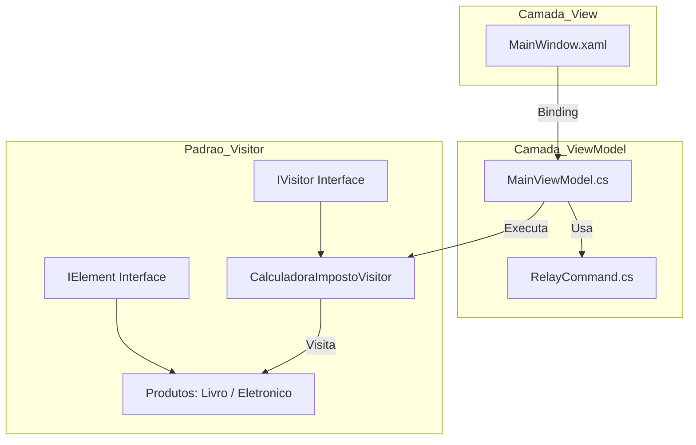

# Projeto Design Pattern Visitor
Este projeto foi desenvolvido como parte da atividade de Situação de Aprendizagem para a disciplina de Desenvolvimento de Sistemas. O objetivo principal é demonstrar a implementação prática do padrão de projeto Visitor, utilizando a arquitetura MVVM em uma aplicação WPF (C#).

---
##  Tecnologias Utilizadas

- Linguagem: C#;

- Framework UI: WPF (.NET);

- Arquitetura: MVVM (Model-View-ViewModel);

- Padrão de Projeto: Visitor.


##  Arquitetura do Projeto (Visitor + MVVM)


---

##  Estrutura do Projeto - Command/RelayCommand

Quando selecionado dentro do projeto a 'BRANCH' master da para ver claramente as organização do código, como tive problema em subir pelo git com o main consegui somente com o MASTER foi organizado conforme as melhores práticas de desenvolvimento e como aprendido em sala o modelo MVVM (sendo uma arquitetura de software que separa a interface do usuário (View) da lógica de negócios (Model) através de uma camada intermediária (ViewModel), facilitando a manutenção e os testes unitários.) Sabendo disso a organização do meu trabalho começou pela pasta Command possuindo a classe RelayCommad que foi esponsável por encapsular a lógica de execução dos botões da interface. Segue abaixo o código utilizado:

```

using System.Windows.Input;
  
namespace AppVisitor.Commands;
  
public class RelayCommand: ICommand{
  
    private readonly Action execute;
    private readonly Func<bool> canExecute;
  
    public RelayCommand(Action execute, Func<bool> canExecute = null)
    {
        this.execute = execute;
        this.canExecute = canExecute;
    }
  
    public bool CanExecute(object parameter)
    {
        return canExecute == null || canExecute();
    }
  
    public void Execute(object parameter)
    {
        execute();
    }
          
    public event EventHandler CanExecuteChanged
    {
        add { CommandManager.RequerySuggested += value; }
        remove { CommandManager.RequerySuggested -= value; }
    }
          
};
```
---
## Estrutura do Projeto - Data/BaseViewModel, DataBase, RelatorioVisitor, TarefaRepository e UsuarioRepository
A pasta Data é a parte mais importante do projeto, sendo responsável por isolar toda a complexidade de infraestrutura e persistência da lógica de interface. Nesta camada, o SQLite é gerenciado para garantir que os dados sejam salvos permanentemente, enquanto os Repositories abstraem as consultas SQL, permitindo que a ViewModel solicite dados sem saber "como" eles são buscados.

Além disso, é aqui que reside a inteligência do padrão Visitor aplicada à geração de informações: o RelatorioVisitor.cs utiliza os dados brutos vindos do banco para transformá-los em um produto final formatado, provando que podemos estender as funcionalidades do sistema sem poluir nossos modelos originais. E consigo pegar a linguagem escolhida que é o Visitor.

BaseViewModel:

```
using System.ComponentModel;

namespace AppVisitor.Models;
public class BaseViewModel : INotifyPropertyChanged
{
    public event PropertyChangedEventHandler PropertyChanged;

    protected void OnPropertyChanged(string prop)
    {
        PropertyChanged?.Invoke(this, new PropertyChangedEventArgs(prop));
    }
}
```
---

DataBase:

```
using System;
using System.IO;
using Microsoft.Data.Sqlite; 

namespace AppVisitor.Data;

public static class DataBase
{
    private static readonly string pastaBase = Path.Combine(
        Environment.GetFolderPath(Environment.SpecialFolder.MyDocuments), "AppVisitor");

    private static readonly string caminhoBanco = Path.Combine(pastaBase, "tarefas.db");
    private static readonly string connectionString = $"Data Source={caminhoBanco}";

    static DataBase()
    {
        
        if (!Directory.Exists(pastaBase))
            Directory.CreateDirectory(pastaBase);

        
        using (var conn = GetConnection())
        {
            conn.Open();
            var cmd = conn.CreateCommand();
            cmd.CommandText = @"
                CREATE TABLE IF NOT EXISTS Usuario (
                    id_usuario INTEGER PRIMARY KEY AUTOINCREMENT, 
                    nome TEXT
                );
                CREATE TABLE IF NOT EXISTS Tarefa (
                    id_tarefa INTEGER PRIMARY KEY AUTOINCREMENT, 
                    titulo TEXT, 
                    conteudo TEXT, 
                    concluida INTEGER, 
                    data_limite TEXT, 
                    fk_usuario_id INTEGER,
                    FOREIGN KEY(fk_usuario_id) REFERENCES Usuario(id_usuario)
                );";
            cmd.ExecuteNonQuery();
        }
    }
    
    public static SqliteConnection GetConnection() 
    {
        return new SqliteConnection(connectionString);
    }
}
```

RelatorioVisitor:

```
using System.Text;
using AppVisitor.Models;

namespace AppVisitor.Data;

public class RelatorioVisitor : IVisitor
{
    private StringBuilder _sb = new StringBuilder();

    public string Resultado => _sb.ToString();

    // Lógica do Visor
    public void VisitUsuario(Usuario usuario)
    {
        _sb.AppendLine("**************************************");
        _sb.AppendLine($"RELATÓRIO ORGANIZADO DE: {usuario.Nome.ToUpper()}");
        _sb.AppendLine("**************************************\n");
    }
    
    public void VisitTarefa(Tarefa tarefa)
    {
        string status = tarefa.Concluida ? "[CONCLUÍDA]" : "[ PENDENTE ]";
        _sb.AppendLine($"{status} - {tarefa.Titulo}");
        if (!string.IsNullOrEmpty(tarefa.Conteudo))
            _sb.AppendLine($"   Nota: {tarefa.Conteudo}");
    }
}
```
---
TarefaRepository:
```
using System;
using System.Collections.Generic;
using AppVisitor.Models;
using Microsoft.Data.Sqlite;

namespace AppVisitor.Data;

public class TarefaRepository
{
    public void Inserir(Tarefa tarefa)
    {
        using var conn = DataBase.GetConnection();
        conn.Open();
        var cmd = new SqliteCommand(
            "INSERT INTO Tarefa (titulo, conteudo, concluida, data_limite, fk_usuario_id) VALUES (@t, @c, @con, @d, @u)", 
            conn);

        cmd.Parameters.AddWithValue("@t", tarefa.Titulo);
        cmd.Parameters.AddWithValue("@c", tarefa.Conteudo ?? "");
        cmd.Parameters.AddWithValue("@con", tarefa.Concluida ? 1 : 0);
        cmd.Parameters.AddWithValue("@d", tarefa.Data_Limite?.ToString("yyyy-MM-dd") ?? (object)DBNull.Value);
        cmd.Parameters.AddWithValue("@u", tarefa.Fk_Usuario_Id ?? (object)DBNull.Value);

        cmd.ExecuteNonQuery();
    }

    public List<Tarefa> Listar()
    {
        var lista = new List<Tarefa>();
        using var conn = DataBase.GetConnection();
        conn.Open();
        var cmd = new SqliteCommand("SELECT * FROM Tarefa", conn);
        using var reader = cmd.ExecuteReader();
        while (reader.Read())
        {
            lista.Add(new Tarefa {
                Id_Tarefa = reader.GetInt32(0),
                Titulo = reader.GetString(1),
                Conteudo = reader.IsDBNull(2) ? "" : reader.GetString(2),
                Concluida = reader.GetInt32(3) == 1,
                Data_Limite = reader.IsDBNull(4) ? null : DateTime.Parse(reader.GetString(4))
            });
        }
        return lista;
    }
}
```
---
UsuarioRepository:
```
using System;
using Microsoft.Data.Sqlite;

namespace AppVisitor.Data;

public class UsuarioRepository
{
    public int InserirOuRetornarId(string nome)
    {
        using var conn = DataBase.GetConnection();
        conn.Open();
        
        var cmd = new SqliteCommand("SELECT id_usuario FROM Usuario WHERE nome = @nome", conn);
        cmd.Parameters.AddWithValue("@nome", nome);
        
        var result = cmd.ExecuteScalar();
        if (result != null)
            return Convert.ToInt32(result);
        
        cmd = new SqliteCommand("INSERT INTO Usuario(nome) VALUES (@nome); SELECT last_insert_rowid();", conn);
        cmd.Parameters.AddWithValue("@nome", nome);
        
        return Convert.ToInt32(cmd.ExecuteScalar());
    }
}
```
---

##  Estrutura do Projeto - Models/IVistor, Tarefa e Usuario

A pasta Model implementa a interface IElement, o que significa que cada objeto de modelo "abre suas portas" para ser visitado por um consultor externo (o Visitor). Essa abordagem é o que permite que o sistema seja extensível: se amanhã precisarmos de um exportador para Excel ou um calculador de prazos, não precisaremos alterar uma única linha de código dentro das classes Tarefa ou Usuario; basta criar um novo Visitor que saiba como interagir com elas através do método Accept.

---
IVisitor:
```
namespace AppVisitor.Models;

public interface IVisitor {
    void VisitTarefa(Tarefa tarefa);
    void VisitUsuario(Usuario usuario);
}

public interface IElement {
    void Accept(IVisitor visitor);
}
```

---
Tarefa:
```
namespace AppVisitor.Models;
public class Tarefa : IElement {
    public int Id_Tarefa { get; set; }
    public string Titulo { get; set; }
    public string Conteudo { get; set; }
    public bool Concluida { get; set; }
    public DateTime? Data_Limite { get; set; }
    public int? Fk_Usuario_Id { get; set; }
    public void Accept(IVisitor visitor) => visitor.VisitTarefa(this);
}
```

---
Usuario:
```
namespace AppVisitor.Models;
public class Usuario : IElement {
    public int Id_Usuario { get; set; }
    public string Nome { get; set; }
    public void Accept(IVisitor visitor) => visitor.VisitUsuario(this);
}
```
